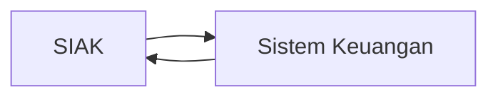

# Bahasa Markup

Struktur, konten dan presentasinya berbeda. Pada bahasa markup, memungkinkan adanya pemisahan bagian bagian konten sehingga bisa dimengerti oleh komputer untuk nantinya dipresentasikan.

## XML

Terdapat utilisasi pada struktur konten, XML itu tagnya bisa dipersonalisasi, validasi, dan penggunaannya banyak di web, dia tidak bergantung pada suatu vendor tertentu, karena merupakan text file, formatnya cenderung sam dan tidak berubah.

```xml
<note>
  <to>Tove</to>
  <from>Jani</from>
  <heading>Reminder</heading>
  <body>Don't forget me this weekend!</body>
</note>
```

XML itu notasinya agak susah dibaca dan mengandung banyak pengulangan, redundan sehingga membutuhkan memori besar. Sehingga, biasanya ada format lain yang digunakan, misalnya JSON

## Operabilitas Syntatic melalui Standardisasi

interoperability: Kemampuan suatu sistem komputer atau perangkat lunak untuk bertukar dan menggunakan informasi.



Di pertukaran itu, ada standar dan formatnya untuk berkomunikasi. Jika mereka bsia mengkomunikasikan data, kita sebut itu interoperable. Melalui standardisasi, misalnya W3C, ISO, atau yang lainnya, suatu struktur bisa digunakan untuk interopability.

| Jenis     | Aplikasi                          |
| --------- | --------------------------------- |
| System    | API, Protokol akses               |
| Syntax    | Data Format                       |
| Structure | Relational, Tree Structure, Skema |
| Semantic  | Makna atau artinya                |

```xml
<artifact>
  <id>GC:A23098</id>
  <target>cup</target>
  <material>gold</material>
  <creationLocation>Bali</creationLocation>
  <originalOwner>Puri Klungkung</originalOwner>
</artifact>
```

Metadata saja tidak bisa mencari/menquery:

- Mencari semua vessels? (Tidak tau apakah `cup` itu vessel atau bukan)
- Mencari sebuah produk logam? (Tidak tau apakah `gold` itu logam atau bukan)
- Mencari semua artifak yang dibuat di Asia Tenggara (Tidak tau apakah `Bali` itu bagian dari Asia Tenggara atau bukan)


## The Resource Description Framework (RDF) 

```turtle
GC-A23098
  rdfs:label “Cup” ;
  :object object:cup ;
  :material material:gold ;
  :creationLocation place:Bali ;
  :originalOwner actor:PuriKlungkung .

object:cup rdfs:subClassOf object:vessel .
place:Bali loc:partof place:Indonesia .
place:Indonesia loc:partOf place:SouthEastAsia .
```

## Semantic Web

- Sudut pandang konten: Lapisan metadata baru pada web yang mendeskripsikan konten dengan istilah kosa katanya dibagikan.
  - Web menjadi sebuah sistem basis data global
  - Jejaring data
- Sudut pandang aplikasi: Web yang dimengerti oleh mesin
  - Makna atau semantik dari suatu konten yang dapat diakses oleh mesin
  - Layanan web yang pintar
  - Interoperabilitas dari makna tersebut oleh berbagai sistem komputer
- Sudut pandang teknologi: sebagai sebuah lapisan di atas XML.

Contoh knowledge graph: Wikidata

# Graph Based Data models

Sebenarnya saat kita ingin mencari suatu informasi, kita sebenarnya mencari suatu entitas, mencari suatu "thing", instead of "string" doang. Di sini lah *knwoledge graph* dapat digunakan. Google mencetuskan sebuah knowledge graph. Setiap entitas atau thing bisa menjadi sebuah informasi yang berhubungan dengan entitas entitas lain. 

https://blog.google/products/search/introducing-knowledge-graph-things-not/

## Knowledge Graph

Knowledge graph sudah digunakan sejak 1973, karena definisinya banyak dan kadang dia bisa conflicting. Sebuah knowledge graph adalah graph data yang digunakan untuk mengumpulkan informasi dan pengetahuan di dunia nyata. Dengan node merepresentasikan objek dan edgenya merepresentasikan hubungan antara setiap entitas.

- Data graph itu data model yang berbentuk graph
- Knowledge mengarah kepada sesuatu yang kita sudah ketahui.

Knowledge pada KG (Knowledge Graph)

- Simple Statements

  - ```mermaid
    graph LR;
    Jakarta(Jakarta)-->|Ibukota|Indonesia(Indonesia)
    ```

- Quantifed Statements 

  - Setiap ibukota adalah sebuah kota, kita tidak mungkin membuat edge. untuk semuanya, karena ini tuh itungannya lebih ke ontologi atau aturan. Lebih ekspresif sekadar dibikin node

Untuk mendapatkan lebih banyak informasi, kita bisa menyimpulakn dengan metode deduktif atau induktif

- Kita bisa menyimpulkan bahwa Jakarta itu adalah sebuah kota yang benar juga.

### Diversity and Knowledge

Strukturnya bisa benar benar beragam, kita bisa gunakan

- Skema: Struktur yang lebih high level untuk knowledge graph
- Identity: Primary key, semacam pemetaan ke entitas dunia nyata yang asli
- Konteks: Menandakan konteks tertentu

Buat KG, kita bisa ekstrasi, penambahan informasi, pengecekan kualitas, pemolesan

### Practice

Pada praktisnya, ada yang open dan ada yang punya korporat knowledge graphnya. Misalnya ada yang:

- Gratis: DBPedia, Freebase, Wikidata, BBC KG (Buat berita), dan masih banyak buat konteks lainnya
- Enterprise: Google, Bing, Airbnb, Amazon, Facebook, LinkedIn

Termasuk:

- Search, sistem rekomendasi, iklan, analitik bisnis

### Motivating Example

Database itu, misalnya bentuknya

```
Event(name, venue, type, start, end)
```

Secara intuitif, bisa kita modelkan menjadi banyak multiplicities, yang bisa menjadi binary relation yang banyak, dan ujung-ujungnya bisa kita modelkan dalam bentuk graph, itulah yang mendasari keterbergunaan knowledge graph, suatu bentuk basis data dalam bentuk graph.

