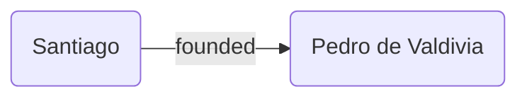
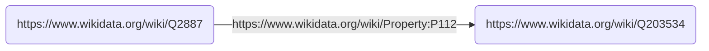
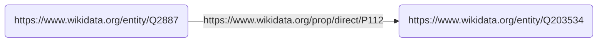
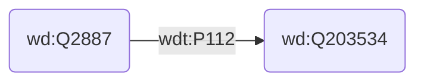

##  2022 Sep 6<sup>th</sup>

Semua instansi relasi biner itu intuitifnya langsung bisa dimodelkan ke graf, tapi masalahnya kenapa kita tidak modelkan ke graph langsung?

### Directed-Edge-Labeled-Graph

Pada graph kita bisa langsung modelkan datanya, tapi menambahkan informasi ke graph itu akan lebih challenging. Pada model data graph, kalau misakan ada kolom yang kosong atau `NULL` itu nanti di graph ga ada panahnya, dan pas mau query itu, jawabannya bukan ya/tidak, tapi informasinya tidak diketahui, bukan tidak ada.

Intinya definisinya itu terdiri dari himpunan verteks $V$, ada himpunan label $L$, dan edges $E$ yang merupakan himpunan yang isinya pasangan berurut yang merupakan subhimpunan dari $V \times L \times V$.

Kalau misalkan kita memiliki dua buah DELG, dan ingin digabungkan kita bisa lakukan operasi union kepada setiap himpunannya.


### Heterogeneous Graph

Pada heterogenous graph, ada tambahan $\ell$ yang merupakan $V \rightarrow L$ yang memetakan setiap verteks ke label $L$


Sebuah edge pada graf ini disebut homogen bila dia berada di antara dua node yang tipe atau labelnya sama. Selain itu, disebut heterogen, misalnya antara chile dan peru itu homogen, dan capital itu heterogen. Graf ini berguna untuk mempartisi node berdasarkan tipenya, berguna untuk machine learning task tertentu. Beda dengan DELG, graph ini hanya mendukung relasi many-to-one antara node dengan tipenya, (setiap node diasosiasikan dengan satu tipe aja ga bisa lebih, atau kaya interface)

### Property Graph

- Property graph biasanya digunakan pada database graph, misalnya pada Neo4j
- Property graph juga bisa diconvert dari dan ke DELG
- DELG menawarkan model yang lebih minimal, sementara property graph menawarkan yang lebih flexibel.
- Sebenarnya dari banyaknya model, itu kita tergantung dari banyak faktor juga misalnya ketersediaan implementasi dari berbagai model berbeda.

### Pertanyaan

- Pada Property Graph:
  - Apakah boleh ada repeated keys? **Boleh**, bukan keys istilahnya, tapi property
  - Apakah setiap Heterogenous graph dan DELG sebenarnya juga merupakan property graph? Jika tidak, seberapa jauh harus kita normalisasi atau minimize sebuah graph hingga dapat disebut sebagai property graph? **Sesingkatnya saja, buatnya tergantung kebutuhan. Pada property graph, node dan edge bisa memiliki property value pair, jadi itu bisa dimanfaatkan** 
  - Apakah setiap node harus memiliki properti? **Tidak mesti**
- Pada DELG, Property, dan Heterogenous
  - Apakah boleh ada double edge yang directionnya sama? **Boleh**

### RDF and The Issue of Identity

Menggunakan node yang ambiguous node bisa menyebabkan penamaan yang bertabrakan. Kita harus menggunakan sebuah identifier yang panjang umur, ada terus selamanya dan ga berubah, dan secara global itu bersifat unik.


- Misalnya ada untuk paper yang namanya DOI (Digital Object Identifiers (DOIs))

- ORCID IDs for researchers
- ISBNs (International Standard Book Numbers) for books.
- Web itu ada yang namanya URL (Uniform Resource Locator) untuk membedakan benda atau resource yang berada di suatu lokasi.

Misalkan kita pengen bikin Santiago di chile itu ditemukan oleh Pedro de Valdivia



Kalau kita menggunakan URL:

- URL untuk Santiago di Chile di Wikidata
  https://www.wikidata.org/wiki/Q2887
- URL buat Pedro de Valdivia:
  https://www.wikidata.org/wiki/Q203534
- URL buat relasi ‘founded by’ di Wikidata:
  https://www.wikidata.org/wiki/Property:P112



Tapi ini tidak cukup, apakah Pedro yang menemukan kota Santiago atau yang menemukan URL nya.

- Tapi di sini kita extend ideanya URL untuk menggunakan Internationalized Resource Identifier (IRI) — dulunya namanya Uniform Resource Identifier (URI).
- Dia merupakan identifier, tapi juga merupakan lokasi di web.

- Setiap URL itu IRI, karena setiap URL itu identifier ke dokumen di web.





### Konvensi

```
IRI ::= scheme:[//authority]path[?query][#fragment]
```

- Scheme: `http, https, ftp, mailto, urn`
  - Case insensitive
- Authority: `kgbook.org, john@example.com, example.org:8080`
  - Case insensitive

- Path: `/etc/passwd, this/path/with/-:_ /is/../okay`
  - Case sensitive
  - May be empty
- Query: `q=Semantic+Web+book`
  - Case sensitive
  - May be empty
- Fragment: `#section1`
  - Case sensitive
  - May be empty

Kita prefer menggunakan `https` atau `http` karena sebenarnya udah kebind sama web protocol. IRI itu harus persistent, harus tetap hidup dan menunjuk ke resource yagng sama selamanya. Bagian querynya mesti kosong. 

- IRI itu globally unique, hostnamenya merujuk ke suatu data owner tertentu.
- Uniquenessnya dipastikan oleh data owner
- Jadi dia globally unique.

### Datatype

Datetime pada knowledge graph bisa kita jadikan datatype, karena bisa diparse oleh mesin dan kita anggap sebagai literal dengan datatype. Misal untuk datetime, `“2018-03-22T12:00:00”^^xsd:dateTime`. Kalau di RDF, node yang gini ga boleh ada edge ke luar. Ada pula `xsd:string`, `xsd:decimal`

### RDF

RDF triple itu dinyatakan dalam bentuk $(s, p, o)$.

- $s$, subject, bsia IRI atau blank node.
- $p$, mesti IRI
- $o$, bisa iri, blank, atau literal.

Kalau RDF graph itu himpunan triple. Dari DELG, kita tinggal menentukan node mana ayng literal dan tipenya apa, terus sisanya bisa kita IRI dan jadikan dia object entitas sendiri.

