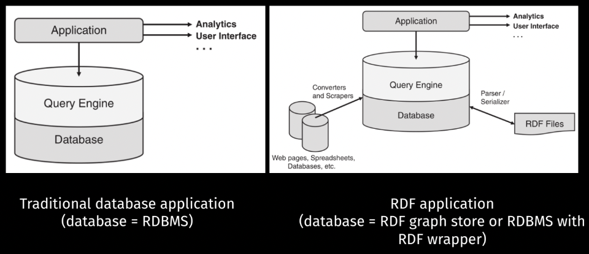

### N-Triple Format

- Setiap triple dinyatakan satu satu untuk setiap barisnya
- Setiap triple diakhiri dengan titik.
- IRI dan datatypenya ditulis secara lengkap dan tidak ada abbreviation
- Unicode charactersnya ditulis pakai escape sequence
- Ekstensinya `.nt`

Buat IRI biasanya, namespacenya dibuat serupa, namun untuk setiap relasi, tipe dan entitas dibuat pattern IRInya berbeda.

Ada N-Triples:

```turtle
<http://example.org/data/Vi\u00F1adelMar> <http://example.org/vocab#bus>
<http://example.org/data/Arica> .
<http://example.org/data/EID15> <http://example.org/vocab#venue>
<http://example.org/data/SantaLuc\u00EDa> .
<http://example.org/data/SantaLuc\u00EDa> <http://example.org/vocab#city>
<http://example.org/data/Santiago> .
```

### Turtle Format

- Triple dan triple group diakhiri dengan titik
- Subjectnya sama bisa dishare dan dipisah dengan titik koma
- Subject dan predikat sama bisa dipisah dengan koma
- Namespace prefix bisa digunakan, didefinisikan dengan syntax prefix
- Karakter unicode tidak perlu diescape
- Ekstensinya `.ttl`,
- Konversi online tools nya banyak  https://issemantic.net/rdf-converter (ada visualizer RDF nya juga) or https://www.easyrdf.org/converter. Library seperti Jena juga bisa digunakan untuk baca format ini

```turtle
@prefix xsd: <http://www.w3.org/2001/XMLSchema#> .
@prefix rdf: <http://www.w3.org/1999/02/22-rdf-syntax-ns#> .
@prefix ex: <http://example.org/data/> .
@prefix exv: <http://example.org/vocab#> .

ex:EID15 rdf:type ex:OpenMarket, ex:FoodFestival, ex:DrinksFestival ;
exv:name "Ñam" ;
exv:start "2018-03-22T12:00:00"^^xsd:dateTime ;
exv:end "2018-03-29T20:00:00"^^xsd:dateTime ;
exv:venue ex:SantaLucia .

ex:SantaLucia exv:city ex:Santiago .
ex:EID16 rdf:type ex:OpenMarket, ex:FoodFestival ;
exv:name "Food Truck"^^xsd:string ;
exv:venue ex:Sotomayor, ex:PiscinaOlimpica .
```

#### Blank Node

Merupakan sebuah existential node, atau anonymous node, blank node bukan literal dan sifatnya seperti entity, tapi tidak diberi identifier atau IRI. Gunanya digunakan untuk sesuatu yang belum diketahui, tapi masih ada hubungan ketergunaan.

Misal, ada dua event `chile:EID42` dan `chile:EID43` yang venuenya sama namun venuenya belum ditentukan. Alternatif solusi:

- Edge venue ga usah dibuat
  - Nanti Informasi bahwa kedua venuenya sama ga diketahui
- Buat IRI baru yang merepresentasikan ventu
  - Tidak bisa dibedakan secara semantik dengan venue yang sudah diketahui
- Gunakan blank node

```turtle
chile:EID42 chile:venue _:b1.
chile:EID43 chile:venue _:b2.
```

Kalau untuk kasus lain misal ada dua event yang diselenggarakan di GBK dan JIS:

```turtle
[] ex:venue ex:GBK, ex:JIS.
```

```turtle
[ ex:venue ex:GBK, ex:JIS ].
```

Apa bedanya indentifier dan IRI, scopenya berbeda, untuk IRI berlaku global, sementara blank node hanya berlaku pada satu dokumen RDF saja.

Di DELG juga bisa ada blank node.

##### Many-Value Representation with Blank Nodes

```turtle
@prefix ex: <http://example.org/> .
ex:Chutney ex:hasIngredient _:b1, _:b2 .
_:b1 ex:ingredient ex:greenMango; ex:amount "1 lb." .
_:b2 ex:ingredient ex:CayennePaper; ex:amount "1 tsp." .
```

##### RDF Lists

```turtle
chile:Chile chile:peaks
(chile:OjosDelSalado chile:NevadoTresCruces chile:Llullailaco) .
```

Serupa dengan 

```turtle
chile:Chile chile:peaks _:b1.
_:b1 rdf:first chile:OjosDelSalado; rdf:rest _:b2.
_:b2 rdf:first chile:NevadoTresCruces; rdf:rest _:b3.
_:b3 rdf:first chile:Llullailaco; rdf:rest rdf:nil.
```

#### Lexicalization

IRI bisa dibuat dalam bentuk yang dapat dimengerti oleh manusia, misalnya `chile:Santiago`. Tapi identifiernya sebenarnya tidak ada signifikan arti atau semanticnya, jadi boleh aja menggunakan string acak sebagai identifier, asal tidak ambiguous.

Contoh: di Wikidata, identifier Eswatini adalah wd:Q1050

- Tidak perlu memilih IRI berdasarkan bahasa: `wd:Eswatini` (English), `wd:eSwatini` (Swahili), or `wd:Esuatini` (Spanish).

Tapi kita bisa memberikan label jika ingin membuat dia lebih readable

```turtle
wd:Q1050 rdfs:label "Swatini"
wd:Q1050 rdfs:label "Swatini"@en
wd:Q1050 rdfs:label "eSwatini"@sw
wd:Q1050 rdfs:label "Suatini"@es
```

Bisa juga tambahin informasi linguistik lain `skos:altLabel` untuk alias dan komentar `rdfs:comment`

Gunanya buat apa?

- Membantu pengguna mengidentifikasi entitas dunia nyata dari suatu node pada knowledge graph yang dimaksud.
- Membolehkan referensi silang buat teks agar lebih mudah mencari detailnya tentang suatu entitas.
- Bisa membantu antarmuka tampilan datanya.

### RDF Architecture

Sumber-sumbernya banyak:

- Datanya dibuat secara manual
- Dari dokumen RDF lain, tapi ini butuh parser sama serializer.
- Dari spreadsheet, halaman web, dibutuhkan scraper dan converterny.
- Database relasional kita butuh wrapper untuk database dari model relationalnya ke rdf.

Cara dapetinnya:

- Mencari dan memproses dari text, tapi bisa susah,
- Cara yang lebih baik adalah dengan mengquery, terutama jika RDFnya distore pada basis data yang relasional, sehingga dibutuhkan mesin untuk menyimpan dan mengquery mesin.
  - Kita bisa tambahin mesin yang ada reasoningnya, untuk menambahkan makna atau semantik yang lebih dalam.

https://blazegraph.com/



- RDF parsers: Buat baca RDF

- RDF serializers: Buat nulis ke memori

Biasanya di satu library sudah include keduanya dan bisa diserialisasi ke berbagai macam format, dari n-triples, turtle, json-ld, dan urutannya bisa berbeda, serta blank node IDnya tapi merepresentasikan graf yang sama. Aplikasinya bisa pakai Apache Jena, Apache any23, rdflib, Eclipse rdf4j, JsonLD, dkk.

RDF store itu suatu basis data yang menyimpan data RDF, beberapa ada yang merupakan ekstensi dari RDBMS biasa, dibikin jadi semacam triple table, edgesnya bisa dibuat binary relations, bisa juga ada property tables.

Data pada RDF store bisa diakses dengan yang namanya SPARQL query, nanti akan diproses oleh query engine, setiap RDF store ada query enginenya, querynya dijalankan ga dari file RDF nya tapi di basis datanya, ada pula protokolnya untuk komunikasi query dan hasilnya.

Ada pula reasoning engines, yang bisa memproses inferensi logika dari data-datanya, termasuk dari kata kerja (edge, verb) dan dua objek (node) nya. Istilah data federation ini: penyatuan data ini biasanya untuk setiap triple disimpan dalam satu penyimpanan. Gunanya agar querynya lebih mudah.

Salah satu contoh dari RDF ini ialah pada schema.org. Jika kita buat menggunakan schema.org, bisa meningkatkan expose dari SEO ke website kita.

### Basic Graph Pattern

RDF itu pada dasarnya merupakan graf, dan query itu kita bisa nyatakan dalam sebuah pattern atau pola yang bentuknya serupa (homomorphism) dengan yang ada di graph. Kita lakukan matching query terhadap graph.


Pada dasarnya untuk query itu ialah kita bikin pola untuk diquery ke graph, seperti yang contoh di slide, itu bila kita ingin query food festival, venuenya di mana saja.

Homorphism Query:

| ?ev   | ?vn1             | ?vn2             |
| ----- | ---------------- | ---------------- |
| EID16 | Piscina Olímpica | Sotomayor        |
| EID16 | Sotomayor        | Piscina Olímpica |
| EID16 | Piscina Olímpica | Piscina Olímpica |
| EID16 | Sotomayor        | Sotomayor        |
| EID15 | Santa Lucía      | Santa Lucía      |

Isomorphism Query: Hanya dapat yang pertama dan kedua.

Intinya: untuk setiap connected subgraph, dimatching bentuknya apakah sama dengan query.

- Isomorphism, dia bakal mapping untuk setiap vertex secara bijektif (kodomain sama dengan range).
- Homomorphism, mappingnya tidak harus bijektif.
- Epimorphism: surjective doang
- Monomorphism: injective doang

Setelah dimap, cek apakah edges hasil map needlenya sama dengan graph haystack. Untuk semua sifat fungsi:

- Injective (One-to-one): Boleh menjomblo, tidak boleh poligami
- Surjective (onto): Tidak boleh menjomblo, boleh poligami
- Bijektif (One to one and onto): Tidak boleh menjomblo, tidak boleh poligami

Perhatikan bahwa dalam query ini ada beberapa node yang mesti dimap ke node spesifik tertentu sehingga querynya lebih sempit. Untuk SPARQL, kita pakainya homomorphism.

```SPARQL
select ?ev ?vn1 ?vn2
where {
	?ev rdf:type ex:FoodFestival ;
			exv:venue ?vn1, ?vn2 .
}
```

SPARQL (SPARQL Protocol and RDF Query Language)