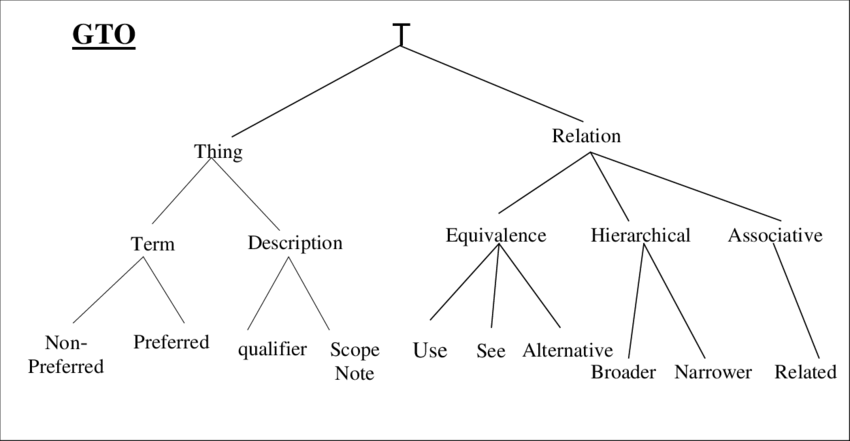
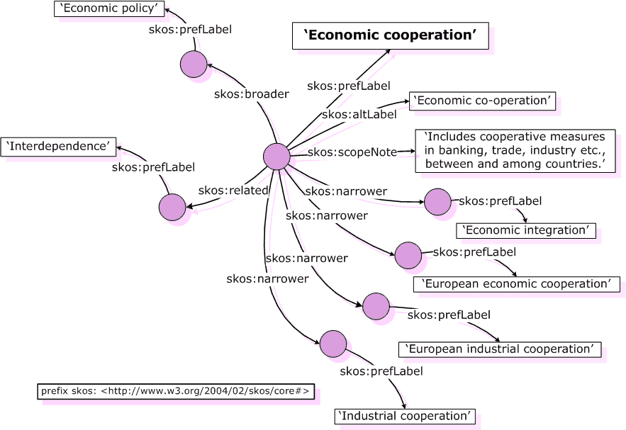

#### Ontologies	


Terdapat 4 perspektif untuk ontology:

- Filosofis
  - Studi yang memperlajari makna dari suatu benda, essence of being
  - Aristotle mengabstraksikan setiap benda itu menjadi 10 benda, (ibarat taksonomi)
  - Ontologi formal terdiri dari beberapa teori:
    - Bagian dan keutuhan
    - Teori waktu
    - Fisika naif
  - Untuk berkomunikasi butuh semacam suatu model yang dapat dimengerti atau diinterpretasi setiap pihak
  
- Linguistic
  - Makna kata
  - Kamus: Mendaftarkan dan mengindeks semua kata
  - Tesaurus: Menghubungkan konsep dan sinonim, antonim, kesamaan
    - Berasal dari bahasa latin yang artinya treasure, treasury atau storehouse
  - Misalnya pada Roget's Thesaurus ada hubungan abstrak, space, matter, intellect, volition dan affections
  
- Istilah-istilah terminology
  - Konsep analisis makna kata
  - ISO standard
  - Konsep dan term punya beberapa tingkatan atau kelas:
    - Monosemy: Satu term - Konsepnya satu saja
    - Polysemy: Satu term, konsepnya banyak, misalnya kepala panah dan kepala manusia
    - Homonymy: Satu term, tapi konsepnya banyak namun tidak berelasi
      - Bank untuk institusi, Bank untuk sungai, river bank
    - Synonymy: Satu konsep, istilahnya banyak
      - Apartment, flat
  - Term punya definisi yang membatasi (delimiting) dan ada pula yang tidak membatasi
  
  - Ada istilah hyponymy yaitu konsep membagikan hubungan karakteristik umum
    - Hierarki konsep ada super ada subordinatenya
    - Misalnya car dengan vehicle
  - Ada istilah meronymy untuk hubungan partitive
    - hubungan bagian dan seutuhnya
    - Atom pada molekul, kaki kursi pada kursinya
    - Tree dengan root dan branch
  
- Ilmu Komputer

Terdapat dua standar semantic web untuk merepresenasikan ontologi, selain rdfs:

- Web Ontology Language OWL
- Simple Knowledge Organization System SKOS

Ontologi digunakan untuk menspesifikasikan konsep konsep semantik

Pada thesaurus, antar kata terhubung bisa dengan adanya beberapa variasi:

- BT Broader term
- NT Narrower term
- RT Related term
- USE “See”
- UF Used for; opposite of USE
- SN Scope note




Perhatikan bahwa graf tesauri ini sebenarnya belum terlalu formal, dan saat kita ngeprosesnya bisa ada informasi yang hilang, misalnya BT itu bisa merepresentasikan **part-of** atau **subordinate/variant**, RT itu bisa sebagai **cause/effect** atau sebagai **peralatan/produk**

Bila misal kita memiliki hubungan:


Saat kita mencari furnitur, makeup mirror juga bakal diangkat, padahal ga termasuk 


Ini bukan furnitur

##### Ontologi

Ontologi itu merupakan konseptualisasi. Di dunia nyata kita bisa abstraksikan ke konsep konsep. Ontologi mendeskripsikan konsep dan objek pada domain serta berbagai vokabulari yang mendeskripsikannya

Ada concept untuk dimengerti mesin, dan terminologi untuk dimengerti manusia

Definisinya:

- Formal: Syntax dan semantic formal
- Eksplisit: Bisa direpresentasikan dan diproses secara algoritmis, dimengerti oleh mesin
- Shared: Standarnya disetujui oleh kumintas pengguna, memfasilitasi komunikasi
- Konseptualisasi: Memberikan model di dunia nyata

##### Kosa Kata (Vocabulary)

Biasanya istilah untuk model metadata yang merepresentasikan domain

- RDFS
- FOAF (Friend of a Friend) (Buat network of people)
- Dublin Core (Buat jurnal) (prefixnya biasanya dc)

##### Component dari Ontology

- Classes (Tipe, jenis, urutan, kategori)
- Individu (Instance dan Objek)
- Attributes (Properties, slots)
- Relations (Properties, slots)
- Rules dan Axiomsnya

Ontologi juga bisa ditambah menggunakan reasoning, membuatnya menjadi semakin luas dan kompleks

Ontologi digunakan untuk

- Interoperabilitas semantik untuk berbagi konsep
- Tujuan reasoning
  - Pengembangan ontologi
  - Information retrieval untuk query expansion

##### SKOS

Ada relation broader, ada relation broaderTransitive untuk membedakan broader relationsnya


SKOS juga memiliki beberapa reasoning rules, misalnya untuk borderTransitivity yang bsia otomatis diinfer,



Di SKOS, skos:broader/narrower/related dapat dispesifikasikan lagi untuk memiliki beberapa subProperty, misalnya 

```
ex:partOf rdfs:subPropertyOf skos:broader .
```

Untuk memberikan hubungan kecocokan, ada `skos:exactMatch`, `skos:closeMatch`.

Ada juga variasi lain

- skos:broadMatch (< skos:broader)
- skos:narrowMatch (< skos:narrower)

- skos:relatedMatch (< skos:related)

Misal saat kita ingin mengintegrasikan dua dataset, itu kita bisa hubungkan dengan relation ini

##### OWL

Di OWL, selain property, kita bisa tentuin kardinalitasnya, ukurannya, serta hubungan hubungannya
