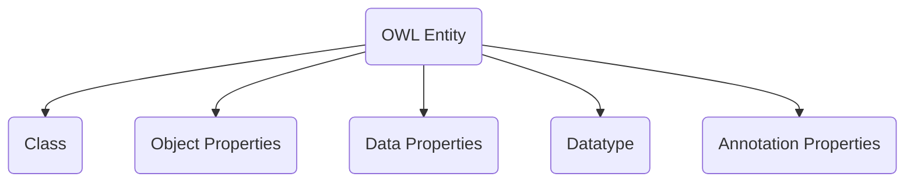
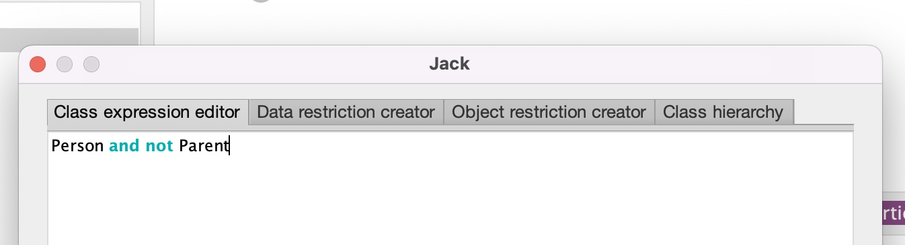
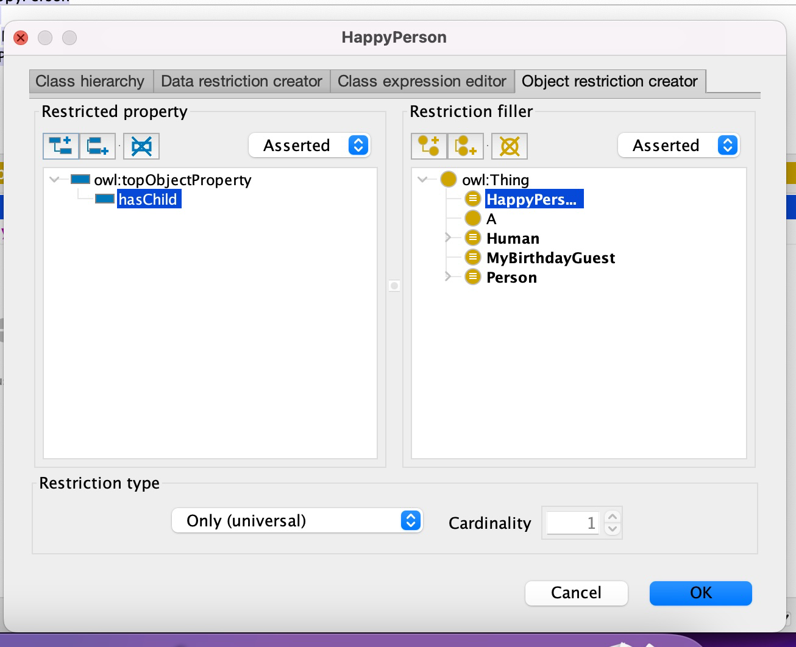
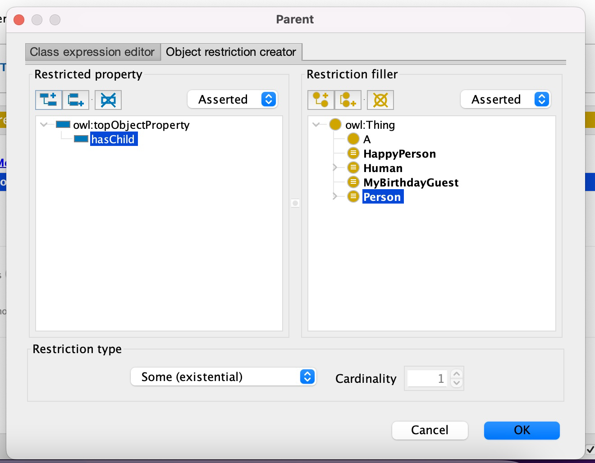
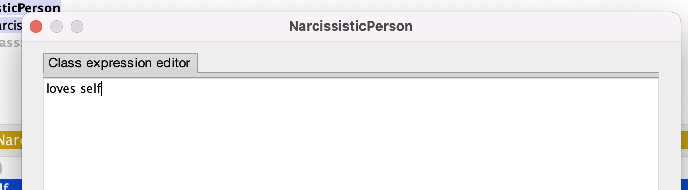

- Pada object property, individu dipetakan ke individu

- Pada data property, individu dipetakan ke literal

- Datatype, individu dipetakan dengan predikat `rdf:type`
- Class dan Datatype merupakan kodomain dari pemetaan `rdf:type`

Di protégé kita bisa bikin semacam (dalam description logic):

- Human $\equiv$ Person

- Man $\cap$ Human $\equiv$ $\emptyset$ 

- MyBirthdayGuest $\equiv$ {Bill, John Mary}

- Parent $\equiv$ Mother $\cup$ Father

- Mother $\equiv$ Human $\cap$ Parent

- Father $\equiv$ Man $\cap$ Parent

- Woman $\subseteq$ Person

- Bill $\neq$ John

- James = Jim

- Woman(Mary)

- (Person $\cap$ $\neg$Parent)(Jack)

  - ```turtle
    ###  http://example.org/vocab#Jack
    v:Jack rdf:type owl:NamedIndividual ,
                    [ owl:intersectionOf ( v:Person
                                           [ rdf:type owl:Class ;
                                             owl:complementOf v:Parent
                                           ]
                                         ) ;
                      rdf:type owl:Class
                    ] .
    ```

  - 

- HappyPerson $\equiv$ $\forall$ hasChild (HappyPerson)

  - HappyPerson(x) $\iff$ $\forall y$ (hasChild(x, y) $\implies$ HappyPerson(y))

  - All quantification, Universal restrictions

  - ```
    ###  http://example.org/vocab#HappyPerson
    v:HappyPerson rdf:type owl:Class ;
                  owl:equivalentClass [ rdf:type owl:Restriction ;
                                        owl:onProperty v:hasChild ;
                                        owl:allValuesFrom v:HappyPerson
                                      ] .
    ```

  - 

  - Perhatikan bahwa seorang HappyPerson tidak harus punya anak

  - Jika seseorang tidak happy person, maka dia punya anak, dan anaknya tidak happy person

- Parent $\equiv$ $\exist$ hasChild(Person)

  - $\forall$ x (Parent(x) $\iff$ ($\exist$ y (hasChild(x, y) $\and$ Person(y)))

  - ```turtle
    v:Parent rdf:type owl:Class ;
             owl:equivalentClass [ rdf:type owl:Class ;
                                   owl:unionOf ( v:Father
                                                 v:Mother
                                               )
                                 ] ,
                                 [ rdf:type owl:Restriction ;
                                   owl:onProperty v:hasChild ;
                                   owl:someValuesFrom v:Person
                                 ] ;
             rdfs:subClassOf v:Human .
    ```

  - 

  - Perhatikan bahwa bila Mary memiliki anak yang bukan person, tidak implies dia bukan parent

    - Jika dia ada anak yang bukan person dan dia parent, implies dia minimal punya dua anak

  - Pada protege, kita juga bisa set dia sehingga punya cardinality minimum atau maksimum atau exact.

  - Bisa juga kita definisikan dia untuk punya value restriction, yang langsung memberikan restriksi ke individu certain

  - Bisa juga self restriction, yang merefer ke dirinya sendiri, misalnya untuk menggambarkan NarcissisticPerson itu jika dan hanya jika loves dirinya sendiri misalnya

    - 

    - ```turtle
      
      v:NarcissisticPerson rdf:type owl:Class ;
                           owl:equivalentClass [ rdf:type owl:Restriction ;
                                                 owl:onProperty v:loves ;
                                                 owl:hasSelf "true"^^xsd:boolean
                                               ] .
      ```

    - Kalau misal dia loves dirinya sendiri, nanti kalau dia diinfer, bisa diketahui kalau tipe datanya otomatis NarcissisticPerson