## The World Wide Web

Internet bisa sangat besar karena dapat digunakan oleh siapapun dan bisa dibilang "gratis", intinya kita hanya perlu membayar ISP saja untuk mengakses web. 

Bahan-bahan dari web:

- Alamat URL (Uniform Resource Locators): Setiap konten pada web direpresentasikan pada sebuah alamat. 
- Bahasa HTML (Hypertext Markup Language): Dokumen pada suatu web membutuhkan sebuah bahasa, yang digunakan itu sebuah **Markup language**, suatu sistem encoding text bersama dengan struktur dan formattingnya.

- HTTP (Hypertext Transfer Protocol): Spesifikasikan cara transder resourcesnya.

## Layanan pada Web

Web itu menyediakan banyak layanan, ada yang fungsional, misalnya untuk bank, berbelanja, pemerintah, dan hiburan tapi dulunya fokusnya pada temu balik informasi, seperti search engine, portal, dan basis data.

Temu balik informasi itu ada tantangannya dalam mengimplementasikannya:

- Formulasi pencariannya, susah untuk mengasosiasikan maksud dengan query yang diberikan.
- Kualitas hasil pencarian:
  - Recall: proporsi informasi relevan yang ditemukan,
  - Precision: proporsi informasi yang ditemukan itu relevan.
  - Relevance: Apakah hasilnya benar sesuai dengan kebutuhan pengguna.
- Presentasi hasil pencariannya apakah mudah dimengerti dan urutan serta pemberian strukturnya.

Search engine membutuhkan konteks yang relevan dan bukan hanya sekadar pencarian kata secara kecocokan saja, kemudian bisa saja ada istilah lain yang merepresentasikan hal yang sama, misalnya pranala dan tautan, dan hewan atau satwa, sama seperti lomba dan kompetisi, dan masih banyak lagi, ada pula homonim, misalnya palu, bisa saja kota maupun alat.

Komputer tidak mengerti hubungan antar konsep, misalnya mencari `asap` belum tentu mengembalikan asap yang ada apinya 🔥, Informasi yang dicari itu terpisah tapi tidak bisa digabung.

Mesin akan sulit untuk mengerti semantic atau makna dari pertanyaan yang diajukan, misalnya menanyakan `Kecamatan Makasar ada di kota mana?`. Dan masih banyak lagi tantangannya untuk mengatur informasi yang ditampilkan dalam pencarian.

## Solusi

Untuk membangun sebuah web yang lebih pintar:

- Bikin aplikasinya lebih pintar
- Kontennya direpresentasikan lebih baik

Nah, semweb itu intinya membuat informasi lebih dipahami dan dimengerti oleh mesin, intinya ada standar dan protokolnya. Kuliah ini membahas data dan representasi pengetahuan dari webnya.


# Bahasa Markup

Struktur, konten dan presentasinya berbeda. Pada bahasa markup, memungkinkan adanya pemisahan bagian bagian konten sehingga bisa dimengerti oleh komputer untuk nantinya dipresentasikan.

## XML

Terdapat utilisasi pada struktur konten, XML itu tagnya bisa dipersonalisasi, validasi, dan penggunaannya banyak di web, dia tidak bergantung pada suatu vendor tertentu, karena merupakan text file, formatnya cenderung sam dan tidak berubah.

```xml
<note>
  <to>Tove</to>
  <from>Jani</from>
  <heading>Reminder</heading>
  <body>Don't forget me this weekend!</body>
</note>
```

XML itu notasinya agak susah dibaca dan mengandung banyak pengulangan, redundan sehingga membutuhkan memori besar. Sehingga, biasanya ada format lain yang digunakan, misalnya JSON

## Operabilitas Syntatic melalui Standardisasi

interoperability: Kemampuan suatu sistem komputer atau perangkat lunak untuk bertukar dan menggunakan informasi.

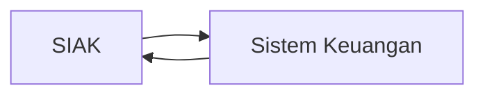

Di pertukaran itu, ada standar dan formatnya untuk berkomunikasi. Jika mereka bsia mengkomunikasikan data, kita sebut itu interoperable. Melalui standardisasi, misalnya W3C, ISO, atau yang lainnya, suatu struktur bisa digunakan untuk interopability.

| Jenis     | Aplikasi                          |
| --------- | --------------------------------- |
| System    | API, Protokol akses               |
| Syntax    | Data Format                       |
| Structure | Relational, Tree Structure, Skema |
| Semantic  | Makna atau artinya                |

```xml
<artifact>
  <id>GC:A23098</id>
  <target>cup</target>
  <material>gold</material>
  <creationLocation>Bali</creationLocation>
  <originalOwner>Puri Klungkung</originalOwner>
</artifact>
```

Metadata saja tidak bisa mencari/menquery:

- Mencari semua vessels? (Tidak tau apakah `cup` itu vessel atau bukan)
- Mencari sebuah produk logam? (Tidak tau apakah `gold` itu logam atau bukan)
- Mencari semua artifak yang dibuat di Asia Tenggara (Tidak tau apakah `Bali` itu bagian dari Asia Tenggara atau bukan)

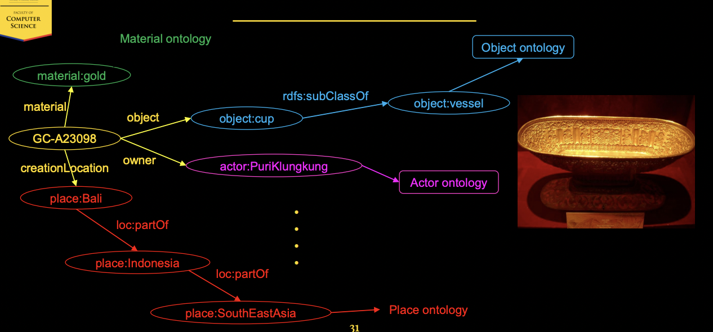

## The Resource Description Framework (RDF) 

```turtle
GC-A23098
  rdfs:label “Cup” ;
  :object object:cup ;
  :material material:gold ;
  :creationLocation place:Bali ;
  :originalOwner actor:PuriKlungkung .

object:cup rdfs:subClassOf object:vessel .
place:Bali loc:partof place:Indonesia .
place:Indonesia loc:partOf place:SouthEastAsia .
```

## Semantic Web

- Sudut pandang konten: Lapisan metadata baru pada web yang mendeskripsikan konten dengan istilah kosa katanya dibagikan.
  - Web menjadi sebuah sistem basis data global
  - Jejaring data
- Sudut pandang aplikasi: Web yang dimengerti oleh mesin
  - Makna atau semantik dari suatu konten yang dapat diakses oleh mesin
  - Layanan web yang pintar
  - Interoperabilitas dari makna tersebut oleh berbagai sistem komputer
- Sudut pandang teknologi: sebagai sebuah lapisan di atas XML.

Contoh knowledge graph: Wikidata

# Graph Based Data models

Sebenarnya saat kita ingin mencari suatu informasi, kita sebenarnya mencari suatu entitas, mencari suatu "thing", instead of "string" doang. Di sini lah *knwoledge graph* dapat digunakan. Google mencetuskan sebuah knowledge graph. Setiap entitas atau thing bisa menjadi sebuah informasi yang berhubungan dengan entitas entitas lain. 

https://blog.google/products/search/introducing-knowledge-graph-things-not/

## Knowledge Graph

Knowledge graph sudah digunakan sejak 1973, karena definisinya banyak dan kadang dia bisa conflicting. Sebuah knowledge graph adalah graph data yang digunakan untuk mengumpulkan informasi dan pengetahuan di dunia nyata. Dengan node merepresentasikan objek dan edgenya merepresentasikan hubungan antara setiap entitas.

- Data graph itu data model yang berbentuk graph
- Knowledge mengarah kepada sesuatu yang kita sudah ketahui.

Knowledge pada KG (Knowledge Graph)

- Simple Statements

  - ```mermaid
    graph LR;
    Jakarta(Jakarta)-->|Ibukota|Indonesia(Indonesia)
    ```

- Quantifed Statements 

  - Setiap ibukota adalah sebuah kota, kita tidak mungkin membuat edge. untuk semuanya, karena ini tuh itungannya lebih ke ontologi atau aturan. Lebih ekspresif sekadar dibikin node

Untuk mendapatkan lebih banyak informasi, kita bisa menyimpulakn dengan metode deduktif atau induktif

- Kita bisa menyimpulkan bahwa Jakarta itu adalah sebuah kota yang benar juga.

### Diversity and Knowledge

Strukturnya bisa benar benar beragam, kita bisa gunakan

- Skema: Struktur yang lebih high level untuk knowledge graph
- Identity: Primary key, semacam pemetaan ke entitas dunia nyata yang asli
- Konteks: Menandakan konteks tertentu

Buat KG, kita bisa ekstrasi, penambahan informasi, pengecekan kualitas, pemolesan

### Practice

Pada praktisnya, ada yang open dan ada yang punya korporat knowledge graphnya. Misalnya ada yang:

- Gratis: DBPedia, Freebase, Wikidata, BBC KG (Buat berita), dan masih banyak buat konteks lainnya
- Enterprise: Google, Bing, Airbnb, Amazon, Facebook, LinkedIn

Termasuk:

- Search, sistem rekomendasi, iklan, analitik bisnis

### Motivating Example

Database itu, misalnya bentuknya

```
Event(name, venue, type, start, end)
```

Secara intuitif, bisa kita modelkan menjadi banyak multiplicities, yang bisa menjadi binary relation yang banyak, dan ujung-ujungnya bisa kita modelkan dalam bentuk graph, itulah yang mendasari keterbergunaan knowledge graph, suatu bentuk basis data dalam bentuk graph.


##  2022 Sep 6<sup>th</sup>

Semua instansi relasi biner itu intuitifnya langsung bisa dimodelkan ke graf, tapi masalahnya kenapa kita tidak modelkan ke graph langsung?

### Directed-Edge-Labeled-Graph

Pada graph kita bisa langsung modelkan datanya, tapi menambahkan informasi ke graph itu akan lebih challenging. Pada model data graph, kalau misakan ada kolom yang kosong atau `NULL` itu nanti di graph ga ada panahnya, dan pas mau query itu, jawabannya bukan ya/tidak, tapi informasinya tidak diketahui, bukan tidak ada.

Intinya definisinya itu terdiri dari himpunan verteks $V$, ada himpunan label $L$, dan edges $E$ yang merupakan himpunan yang isinya pasangan berurut yang merupakan subhimpunan dari $V \times L \times V$.

Kalau misalkan kita memiliki dua buah DELG, dan ingin digabungkan kita bisa lakukan operasi union kepada setiap himpunannya.

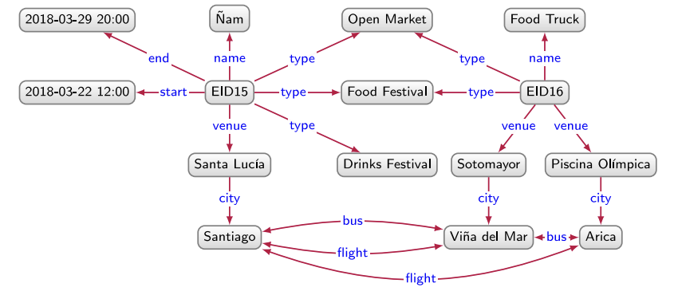

### Heterogeneous Graph

Pada heterogenous graph, ada tambahan $\ell$ yang merupakan $V \rightarrow L$ yang memetakan setiap verteks ke label $L$

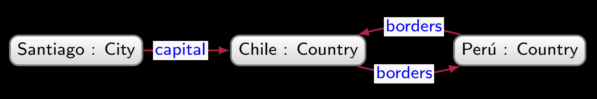

Sebuah edge pada graf ini disebut homogen bila dia berada di antara dua node yang tipe atau labelnya sama. Selain itu, disebut heterogen, misalnya antara chile dan peru itu homogen, dan capital itu heterogen. Graf ini berguna untuk mempartisi node berdasarkan tipenya, berguna untuk machine learning task tertentu. Beda dengan DELG, graph ini hanya mendukung relasi many-to-one antara node dengan tipenya, (setiap node diasosiasikan dengan satu tipe aja ga bisa lebih, atau kaya interface)

### Property Graph

- Property graph biasanya digunakan pada database graph, misalnya pada Neo4j
- Property graph juga bisa diconvert dari dan ke DELG
- DELG menawarkan model yang lebih minimal, sementara property graph menawarkan yang lebih flexibel.
- Sebenarnya dari banyaknya model, itu kita tergantung dari banyak faktor juga misalnya ketersediaan implementasi dari berbagai model berbeda.

### Pertanyaan

- Pada Property Graph:
  - Apakah boleh ada repeated keys? **Boleh**, bukan keys istilahnya, tapi property
  - Apakah setiap Heterogenous graph dan DELG sebenarnya juga merupakan property graph? Jika tidak, seberapa jauh harus kita normalisasi atau minimize sebuah graph hingga dapat disebut sebagai property graph? **Sesingkatnya saja, buatnya tergantung kebutuhan. Pada property graph, node dan edge bisa memiliki property value pair, jadi itu bisa dimanfaatkan** 
  - Apakah setiap node harus memiliki properti? **Tidak mesti**
- Pada DELG, Property, dan Heterogenous
  - Apakah boleh ada double edge yang directionnya sama? **Boleh**

### RDF and The Issue of Identity

Menggunakan node yang ambiguous node bisa menyebabkan penamaan yang bertabrakan. Kita harus menggunakan sebuah identifier yang panjang umur, ada terus selamanya dan ga berubah, dan secara global itu bersifat unik.

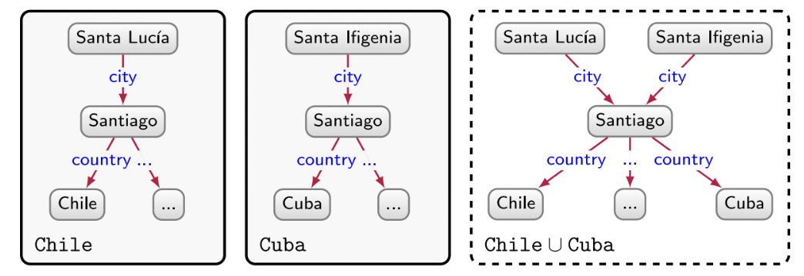

- Misalnya ada untuk paper yang namanya DOI (Digital Object Identifiers (DOIs))

- ORCID IDs for researchers
- ISBNs (International Standard Book Numbers) for books.
- Web itu ada yang namanya URL (Uniform Resource Locator) untuk membedakan benda atau resource yang berada di suatu lokasi.

Misalkan kita pengen bikin Santiago di chile itu ditemukan oleh Pedro de Valdivia

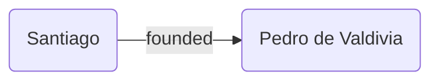

Kalau kita menggunakan URL:

- URL untuk Santiago di Chile di Wikidata
  https://www.wikidata.org/wiki/Q2887
- URL buat Pedro de Valdivia:
  https://www.wikidata.org/wiki/Q203534
- URL buat relasi ‘founded by’ di Wikidata:
  https://www.wikidata.org/wiki/Property:P112

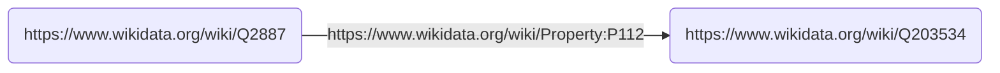

Tapi ini tidak cukup, apakah Pedro yang menemukan kota Santiago atau yang menemukan URL nya.

- Tapi di sini kita extend ideanya URL untuk menggunakan Internationalized Resource Identifier (IRI) — dulunya namanya Uniform Resource Identifier (URI).
- Dia merupakan identifier, tapi juga merupakan lokasi di web.

- Setiap URL itu IRI, karena setiap URL itu identifier ke dokumen di web.

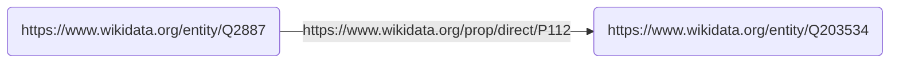

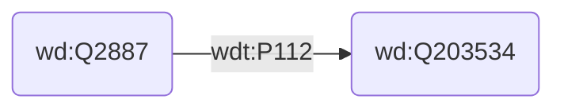

### Konvensi

```
IRI ::= scheme:[//authority]path[?query][#fragment]
```

- Scheme: `http, https, ftp, mailto, urn`
  - Case insensitive
- Authority: `kgbook.org, john@example.com, example.org:8080`
  - Case insensitive

- Path: `/etc/passwd, this/path/with/-:_ /is/../okay`
  - Case sensitive
  - May be empty
- Query: `q=Semantic+Web+book`
  - Case sensitive
  - May be empty
- Fragment: `#section1`
  - Case sensitive
  - May be empty

Kita prefer menggunakan `https` atau `http` karena sebenarnya udah kebind sama web protocol. IRI itu harus persistent, harus tetap hidup dan menunjuk ke resource yagng sama selamanya. Bagian querynya mesti kosong. 

- IRI itu globally unique, hostnamenya merujuk ke suatu data owner tertentu.
- Uniquenessnya dipastikan oleh data owner
- Jadi dia globally unique.

### Datatype

Datetime pada knowledge graph bisa kita jadikan datatype, karena bisa diparse oleh mesin dan kita anggap sebagai literal dengan datatype. Misal untuk datetime, `“2018-03-22T12:00:00”^^xsd:dateTime`. Kalau di RDF, node yang gini ga boleh ada edge ke luar. Ada pula `xsd:string`, `xsd:decimal`

### RDF

RDF triple itu dinyatakan dalam bentuk $(s, p, o)$.

- $s$, subject, bsia IRI atau blank node.
- $p$, mesti IRI
- $o$, bisa IRI, blank, atau literal.

Kalau RDF graph itu himpunan triple. Dari DELG, kita tinggal menentukan node mana ayng literal dan tipenya apa, terus sisanya bisa kita IRI dan jadikan dia object entitas sendiri.


### N-Triple Format

- Setiap triple dinyatakan satu satu untuk setiap barisnya
- Setiap triple diakhiri dengan titik.
- IRI dan datatypenya ditulis secara lengkap dan tidak ada abbreviation
- Unicode charactersnya ditulis pakai escape sequence
- Ekstensinya `.nt`

Buat IRI biasanya, namespacenya dibuat serupa, namun untuk setiap relasi, tipe dan entitas dibuat pattern IRInya berbeda.

Ada N-Triples:

```turtle
<http://example.org/data/Vi\u00F1adelMar> <http://example.org/vocab#bus>
<http://example.org/data/Arica> .
<http://example.org/data/EID15> <http://example.org/vocab#venue>
<http://example.org/data/SantaLuc\u00EDa> .
<http://example.org/data/SantaLuc\u00EDa> <http://example.org/vocab#city>
<http://example.org/data/Santiago> .
```

### Turtle Format

- Triple dan triple group diakhiri dengan titik
- Subjectnya sama bisa dishare dan dipisah dengan titik koma
- Subject dan predikat sama bisa dipisah dengan koma
- Namespace prefix bisa digunakan, didefinisikan dengan syntax prefix
- Karakter unicode tidak perlu diescape
- Ekstensinya `.ttl`,
- Konversi online tools nya banyak  https://issemantic.net/rdf-converter (ada visualizer RDF nya juga) or https://www.easyrdf.org/converter. Library seperti Jena juga bisa digunakan untuk baca format ini

```turtle
@prefix xsd: <http://www.w3.org/2001/XMLSchema#> .
@prefix rdf: <http://www.w3.org/1999/02/22-rdf-syntax-ns#> .
@prefix ex: <http://example.org/data/> .
@prefix exv: <http://example.org/vocab#> .

ex:EID15 rdf:type ex:OpenMarket, ex:FoodFestival, ex:DrinksFestival ;
exv:name "Ñam" ;
exv:start "2018-03-22T12:00:00"^^xsd:dateTime ;
exv:end "2018-03-29T20:00:00"^^xsd:dateTime ;
exv:venue ex:SantaLucia .

ex:SantaLucia exv:city ex:Santiago .
ex:EID16 rdf:type ex:OpenMarket, ex:FoodFestival ;
exv:name "Food Truck"^^xsd:string ;
exv:venue ex:Sotomayor, ex:PiscinaOlimpica .
```

#### Blank Node

Merupakan sebuah existential node, atau anonymous node, blank node bukan literal dan sifatnya seperti entity, tapi tidak diberi identifier atau IRI. Gunanya digunakan untuk sesuatu yang belum diketahui, tapi masih ada hubungan ketergunaan.

Misal, ada dua event `chile:EID42` dan `chile:EID43` yang venuenya sama namun venuenya belum ditentukan. Alternatif solusi:

- Edge venue ga usah dibuat
  - Nanti Informasi bahwa kedua venuenya sama ga diketahui
- Buat IRI baru yang merepresentasikan ventu
  - Tidak bisa dibedakan secara semantik dengan venue yang sudah diketahui
- Gunakan blank node

```turtle
chile:EID42 chile:venue _:b1.
chile:EID43 chile:venue _:b2.
```

Kalau untuk kasus lain misal ada dua event yang diselenggarakan di GBK dan JIS:

```turtle
[] ex:venue ex:GBK, ex:JIS.
```

```turtle
[ ex:venue ex:GBK, ex:JIS ].
```

Apa bedanya indentifier dan IRI, scopenya berbeda, untuk IRI berlaku global, sementara blank node hanya berlaku pada satu dokumen RDF saja.

Di DELG juga bisa ada blank node.

##### Many-Value Representation with Blank Nodes

```turtle
@prefix ex: <http://example.org/> .
ex:Chutney ex:hasIngredient _:b1, _:b2 .
_:b1 ex:ingredient ex:greenMango; ex:amount "1 lb." .
_:b2 ex:ingredient ex:CayennePaper; ex:amount "1 tsp." .
```

##### RDF Lists

```turtle
chile:Chile chile:peaks
(chile:OjosDelSalado chile:NevadoTresCruces chile:Llullailaco) .
```

Serupa dengan 

```turtle
chile:Chile chile:peaks _:b1.
_:b1 rdf:first chile:OjosDelSalado; rdf:rest _:b2.
_:b2 rdf:first chile:NevadoTresCruces; rdf:rest _:b3.
_:b3 rdf:first chile:Llullailaco; rdf:rest rdf:nil.
```

#### Lexicalization

IRI bisa dibuat dalam bentuk yang dapat dimengerti oleh manusia, misalnya `chile:Santiago`. Tapi identifiernya sebenarnya tidak ada signifikan arti atau semanticnya, jadi boleh aja menggunakan string acak sebagai identifier, asal tidak ambiguous.

Contoh: di Wikidata, identifier Eswatini adalah wd:Q1050

- Tidak perlu memilih IRI berdasarkan bahasa: `wd:Eswatini` (English), `wd:eSwatini` (Swahili), or `wd:Esuatini` (Spanish).

Tapi kita bisa memberikan label jika ingin membuat dia lebih readable

```turtle
wd:Q1050 rdfs:label "Swatini"
wd:Q1050 rdfs:label "Swatini"@en
wd:Q1050 rdfs:label "eSwatini"@sw
wd:Q1050 rdfs:label "Suatini"@es
```

Bisa juga tambahin informasi linguistik lain `skos:altLabel` untuk alias dan komentar `rdfs:comment`

Gunanya buat apa?

- Membantu pengguna mengidentifikasi entitas dunia nyata dari suatu node pada knowledge graph yang dimaksud.
- Membolehkan referensi silang buat teks agar lebih mudah mencari detailnya tentang suatu entitas.
- Bisa membantu antarmuka tampilan datanya.

### RDF Architecture

Sumber-sumbernya banyak:

- Datanya dibuat secara manual
- Dari dokumen RDF lain, tapi ini butuh parser sama serializer.
- Dari spreadsheet, halaman web, dibutuhkan scraper dan converterny.
- Database relasional kita butuh wrapper untuk database dari model relationalnya ke rdf.

Cara dapetinnya:

- Mencari dan memproses dari text, tapi bisa susah,
- Cara yang lebih baik adalah dengan mengquery, terutama jika RDFnya distore pada basis data yang relasional, sehingga dibutuhkan mesin untuk menyimpan dan mengquery mesin.
  - Kita bisa tambahin mesin yang ada reasoningnya, untuk menambahkan makna atau semantik yang lebih dalam.

https://blazegraph.com/

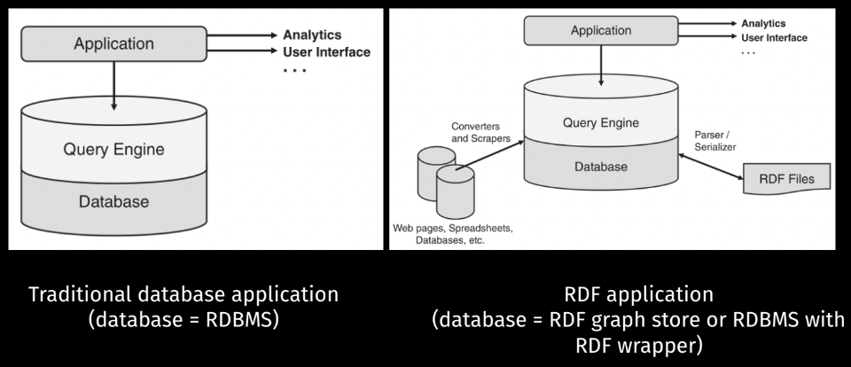

- RDF parsers: Buat baca RDF

- RDF serializers: Buat nulis ke memori

Biasanya di satu library sudah include keduanya dan bisa diserialisasi ke berbagai macam format, dari n-triples, turtle, json-ld, dan urutannya bisa berbeda, serta blank node IDnya tapi merepresentasikan graf yang sama. Aplikasinya bisa pakai Apache Jena, Apache any23, rdflib, Eclipse rdf4j, JsonLD, dkk.

RDF store itu suatu basis data yang menyimpan data RDF, beberapa ada yang merupakan ekstensi dari RDBMS biasa, dibikin jadi semacam triple table, edgesnya bisa dibuat binary relations, bisa juga ada property tables.

Data pada RDF store bisa diakses dengan yang namanya SPARQL query, nanti akan diproses oleh query engine, setiap RDF store ada query enginenya, querynya dijalankan ga dari file RDF nya tapi di basis datanya, ada pula protokolnya untuk komunikasi query dan hasilnya.

Ada pula reasoning engines, yang bisa memproses inferensi logika dari data-datanya, termasuk dari kata kerja (edge, verb) dan dua objek (node) nya. Istilah data federation ini: penyatuan data ini biasanya untuk setiap triple disimpan dalam satu penyimpanan. Gunanya agar querynya lebih mudah.

Salah satu contoh dari RDF ini ialah pada schema.org. Jika kita buat menggunakan schema.org, bisa meningkatkan expose dari SEO ke website kita.

### Basic Graph Pattern

RDF itu pada dasarnya merupakan graf, dan query itu kita bisa nyatakan dalam sebuah pattern atau pola yang bentuknya serupa (homomorphism) dengan yang ada di graph. Kita lakukan matching query terhadap graph.

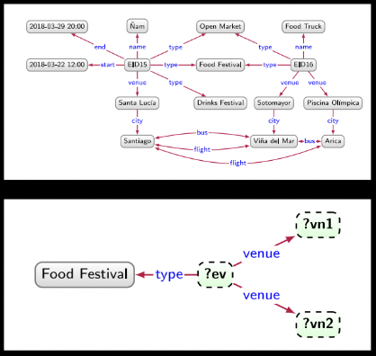

Pada dasarnya untuk query itu ialah kita bikin pola untuk diquery ke graph, seperti yang contoh di slide, itu bila kita ingin query food festival, venuenya di mana saja.

Homorphism Query:

| ?ev   | ?vn1             | ?vn2             |
| ----- | ---------------- | ---------------- |
| EID16 | Piscina Olímpica | Sotomayor        |
| EID16 | Sotomayor        | Piscina Olímpica |
| EID16 | Piscina Olímpica | Piscina Olímpica |
| EID16 | Sotomayor        | Sotomayor        |
| EID15 | Santa Lucía      | Santa Lucía      |

Isomorphism Query: Hanya dapat yang pertama dan kedua.

Intinya: untuk setiap connected subgraph, dimatching bentuknya apakah sama dengan query.

- Isomorphism, dia bakal mapping untuk setiap vertex secara bijektif (kodomain sama dengan range).
- Homomorphism, mappingnya tidak harus bijektif.
- Epimorphism: surjective doang
- Monomorphism: injective doang

Setelah dimap, cek apakah edges hasil map needlenya sama dengan graph haystack. Untuk semua sifat fungsi:

- Injective (One-to-one): Boleh menjomblo, tidak boleh poligami
- Surjective (onto): Tidak boleh menjomblo, boleh poligami
- Bijektif (One to one and onto): Tidak boleh menjomblo, tidak boleh poligami

Perhatikan bahwa dalam query ini ada beberapa node yang mesti dimap ke node spesifik tertentu sehingga querynya lebih sempit. Untuk SPARQL, kita pakainya homomorphism.

```SPARQL
select ?ev ?vn1 ?vn2
where {
	?ev rdf:type ex:FoodFestival ;
			exv:venue ?vn1, ?vn2 .
}
```

SPARQL (SPARQL Protocol and RDF Query Language)
#### Basic Graph Pattern

Intinya merupakan himpunan triple pattern, sebuah tuple $Q(V, E, L)$.

- $V$ itu $\subseteq$ himpunan node terms

- $L$ itu $\subseteq$ himpunan edge label atau terms
- $E$ itu $\subseteq V\times L \times V$ himpunan edgesnya

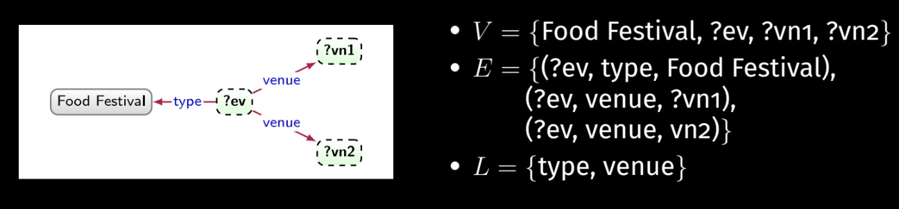

Diberikan sebuah BGP $Q$, yang di atas tadi, definisikan $\text{Var}(Q)$ adalah himpunan semua variabel yang muncul pada $Q$, variabel itu yang ga konstan dan belum dibinding valuenya. Misalkan $\mu: \text{Var} \rightarrow \text{Con}$ , **merupakan sebuah partial mapping**, dari variabel ke konstan pada domainnya si $\mu$, $\text{Con}$ nya bisa berupa $V$ atau $E$ yang penting constant semua isinya.

$\text{dom}(\mu)$: Semua variabel pada mapping $\mu$,

$\mu$ dikatakan solusi terhadap $G$ jika dan hanya jika data graphnya $\mu(Q)$ **merupakan subgraph dari data graph** $G$. $Q(G)$ itu merupakan multiset of solution mapping.
$$
Q(G)=\{\mu \mid \mu(Q) \subseteq G \and \operatorname{dom}(\mu) \subseteq \operatorname{Var}(Q)\}
$$
Bila kita tidak bisa menemukan solution mapping $\mu$, yang merupakan subgraph terhadap query $Q$ nya itu $G$, dan domain dari $\mu$ nya merupakan variabel dari $Q$, artinya semua $\mu$ itu memetakan variabel dari $Q$. Kenapa $\text{dom}(\mu) \subseteq \text{Var}(Q)$, karena tidak semua domainnya perlu kita jawab dan tidak semuanya perlu kita kembalikan semuanya, tapi bisa saja ada query, misalnya kaya

```SPARQL
select ?ev
where {
  ?ev rdf:type ex:FoodFestival ;
  exv:venue ?vn1, ?vn2 .
}
```

Perhatikan bahwa disini yang perlu kita ambil cuma variabel `?ev` nya, tidak perlu $\text{dom}(\mu) = \text{Var}(Q)$. 

Kita katakan data graph $G_1$ itu subgraph dari $G_2$ jika dan hanya jika $V_1 \subseteq V_2, E_1 \subseteq E_2$ dan $L_1 \subseteq L_2$

1. $\mu=\{$ ?ev $\mapsto$ ElD16, ?vn1 $\mapsto$ Piscina Olimpica, ?vn2 $\mapsto$ Sotomayor $\}$
    $\mu(Q)=\{($ EID16, type, Food Festival), (EID16, venue, Priscina Olímpica), (EID16, venue, Sotomayor) $\}$
  - Is $\mu(Q) \subseteq G$ ? **Yes**.
2. $\mu=\{$ ?ev $\mapsto$ ElD16, ?vn1 $\mapsto$ Sotomayor, ?vn2 $\mapsto$ Piscina Olimpica $\}$
    $\mu(Q)=\{($ EID16, type, Food Festival), (EID16, venue, Sotomayor), (EID16, venue, Priscina Olimpica)
  - Is $\mu(Q) \subseteq G$ ? **Yes**.
3. $\mu=\{$ ?ev $\mapsto$ EID16, ?vn1 $\mapsto$ Piscina Olimpica, ?vn2 $\mapsto$ Piscina Olímpica $\}$
    $\mu(Q)=\{($ EID16, type, Food Festival), (EID16, venue, Priscina Olimpica) $\}$
  - Is $\mu(Q) \subseteq G$ ? **Yes**.

Perhatikan bahwa $\mu(Q)$ merupakan set atau himpunan.

Perhatikan bahwa solusi mapping $\mu$ bisa saja $= \empty$, jadi $Q(G) = \{\empty\}$, bisa terjadi saat $\text{Var}(Q) = \empty$, dan ada solusi yang ditemukan. Kalau misalkan tidak ada solution maka $Q(G) = \{\} = \empty$. Bila direcap, menjawab query itu pada dasarnya mengevaluasi BGP pada data graphnya.

#### Blank nodes in Query

Blank nodes dibolehkan pada graph pattern:

- Bisa muncul pada bagian subjek atau objek dari triple (node).
- Diberikan ID tertentu, dan dianggap seperti variabel.
- Seperti variabel, tapi tidak bisa diselect dan diproyeksikan.

Blamk modes bisa muncul pada solusi query atau mapping

- Direpresentasikan dengan entiti yang tidak diketahui.

Perhatikan dua query yang equivalen berikut ini, menggunakan blank nodes. Blank nodes ini bukan literally mengquery blank nodes, tapi jatohnya cuma dummy variable yang ga kepake doang.

```sparql
select ?event ?city where{
	?event rdf:type ?type ;
				 exv:venue ?ven .
	?ven 	 exv:city ?city .
}
```

```sparql
select ?event ?city where{
	?event rdf:type [] ;
				 exv:venue [ exv:city ?city ].
}
```

#### Query involving Literals

Untuk ngematch literal, datatypenya juga harus cocok, bagian yang di dalam tanda petik itu namanya bentuk lexical.

```turtle
@prefix ex: <http://example.org/data/> .
@prefix exv: <http://example.org/vocab#> .

ex:ex1 exv:p "test" .
ex:ex2 exv:p "test"^^xsd:string .
ex:ex3 exv:p "test"@en .
ex:ex4 exv:p "42"^^xsd:integer .
ex:ex5 exv:p 42 .
```

Perhatikan contoh `ex:ex6 exv:p "test"^^xsd:integer` secara syntax ok, tapi graphnya semantiknya unsatisfiable. `"test"` itu bagian lexicalnya, dan `xsd:integer` itu typenya. Semantic wise saat dievaluasi, tidak boleh ada lexical yang tidak cocok dengan data typenya.

```SPARQL
prefix exv: <http://example.org/vocab#> 
SELECT * WHERE {
  ?s exv:p "test" .
}
```

Query di atas bakal ngereturn ex1, ex2 doang, karena yang en itu typenya `rdf:langString`.

```SPARQL
prefix exv: <http://example.org/vocab#> 
SELECT * WHERE {
  ?s exv:p "test"@en .
}
```

Query di atas bakal ngereturn ex3 doang.

```SPARQL
prefix exv: <http://example.org/vocab#> 
SELECT * WHERE {
  ?s exv:p 42 .
}
```

Bakal ngereturn ex4 ex5 juga. Untuk numeric integer, ada syntatic sugarnya, jadi bisa langsung aja ditulis 42 di ex5

#### Select Syntax (Projection)

Ada projection, serupa dengan basis data, itu kita bisa bound dia ke variabel list, atau bisa pake * buat ngeselect all variabel, bisa juga pake DISTINCT buat ngeremove non unique result.

```sparql
prefix exv: <http://example.org/vocab#> 
SELECT DISTINCT ?s ?a WHERE {
  ?s exv:p 42 .
}
```

di sini, `?a` nya bakal kosong di column resultnya.

Ada pula UNION, kita tulisin {$P_1$} UNION {$P_2$}, untuk merepresentasikan dua pola graf, $P_1$ dan $P_2$.

Pada set unionnya itu tetap unique, sementara pada multiset, unionnya simply di plus.

Contoh:

```sparql
PREFIX exv: <http://example.org/vocab#>
PREFIX ex: <http://example.org/>

SELECT ?name ?city WHERE {
  ?event exv:venue ?ven ;
    exv:name ?name .
  {
    ?ven exv:city ex:Santiago .
  } UNION {
    ?ven exv:city ex:Arica .
  }
  ?ven exv:city ?city
}
```

Hasilnya adalah

```
p1 join (p2 union p3) join p4
```

| name           | city                                              |
| -------------- | ------------------------------------------------- |
| Santiago a Mil | [](http://localhost:9999/blazegraph/#explore:kb:) |
| Ñam            | [](http://localhost:9999/blazegraph/#explore:kb:) |
| Food Truck     | [](http://localhost:9999/blazegraph/#explore:kb:) |

Perhatikan juga sifat sifat union:

- Komutatif dan left-asosiatif
- precedencenya setara dengan OPTIONAL
- precedencenya lebih tinggi dari pada conjunction biasa, sehingga bakal diproses duluan, istilahnya kaya perkalian di kalibataku.

Reference: https://www.cs.miami.edu/home/visser/csc751-files/sparql.pdf

Selain itu, ada pula operasi left join, atau yang dikenal dengan optional

- $P_1$ OPTIONAL {$P_2$} artinya dapetin semua solusi mapping buat $P_1$, terus secara opsional join mappingnya dengan $P_2$ kalo ada.
- Kalau solution mapping dari $P_1$ ga bisa dijoin dengan solusi apapun dari $P_2$ tetap dikembaliin dengan ada unbounded variable.

```sparql
SELECT ?name ?start WHERE {
  {
    { ?event rdf:type exv:FoodFestival . }
    UNION
    { ?event rdf:type exv:MusicFestival . }
  	?event exv:name ?name .
  }
  OPTIONAL
  { ?event exv:start ?start . }
}
```

| ?name            | ?start                   |
| ---------------- | ------------------------ |
| Ñam              | 2018-03-22T12:00:00.000Z |
| Food Truck       |                          |
| Santiago a Mil   | 2023-01-09T09:00:00.000Z |
| Festival de Viña |                          |

#### Filter and other expressions

Dengan pattern yang kompleks, masih ada beberapa query yang agak sulit untuk diraih, filter akan menyaring solution mapping dengan mengecek kondisi tertentunya.

```SPARQL
SELECT ?book
WHERE {
	?book ex:publishedBy <http://springer.com> .
  ?book ex:price ?price FILTER (?price < 35) .
}
```

https://en.wikibooks.org/wiki/SPARQL/Expressions_and_Functions

#### Filter scope

Filter berlaku pada solution mapping dalam bloknya yang dibatasi oleh kurung kurawal untuk blok tersebut.

```sparql
{
  ?x foaf:name ?name .
  FILTER regex(?name, "Smith") .
}

{
  FILTER regex(?name, "Smith") .
  ?x foaf:name ?name .
}
```

Kedua query di atas itu sama hasilnya.

Filter exists

```sparql
SELECT ?person WHERE {
   ?person rdf:type foaf:Person.
   FILTER EXISTS {
   		?person foaf:name ?name
   }
}
```

Minus difference bakal ngelakuin $A \and \neg B$

```SPARQL
SELECT DISTINCT ?s WHERE {
	?s ?p ?o .
	MINUS {
		?s foaf:givenName "Bob" .
	}
}
```

Bisa juga melakukan order by, limit, offset, dan distinct serupa dengan SQL.

 #### Values

Kita bisa menggunakan values untuk mengenumerasi tuple pasangan value dan diassign ke variable masing-masing.

### Aggregates

Cara kerjanya mirip dengan di sequel, misalkan kita udah punya suatu projection, kit abisa lakukan group by, dan kemudian ada fungsi agregat yang bisa kita terapkan.

- SUM(?X)
- AVG(?X)
- MIN(?X)
- MAX(?X)
- GROUP_CONCAT(?X ; separator="|")
  - Ini buat menggabungkan string
- SAMPLE(?X)
  - Pilih satu secara acak.

### Subqueries

Subqueries agak tricky, karena di dalam select sebenarnya bisa ada select lagi, tapi scopenya itu ga kebawa, jadi setiap kali ada kurung kurawal baru, dia bakal bikin scope baru.

### Property Paths

Mirip sama regular expression, tapi intinya predikat atau property itu bisa dimodif:

1. IRI
   - normal yang sering kita lakukan

2. ^path
   - invers atau kebalikan dari suatu path, tuker arahnya

3. path1 / path2 

   - Konkatenasi dari suatu path diikuti dengan path lain, ini sebenarnya bisa disingkat menggunakan blank nodes

   - ```sparql
     {
       ?x foaf:mbox <mailto:alice@example> .
       ?x foaf:knows/foaf:knows/foaf:name ?name .
     }
     ```

   - ```sparql
     {
       ?x foaf:mbox <mailto:alice@example> .
       ?x foaf:knows [ foaf:knows [ foaf:name ?name ] ].
     }
     ```

4. path1 | path2
   - antara path1 atau path2, 

5. path* 
   - 0 atau lebih langkah untuk path ini

6. path+
   - 1 atau lebih langkah.

7. path?
   - 0 atau 1 langkah

8. !(iri<sub>1</sub>|...|iri<sub>n</sub>)
   - Kecuali iri<sub>1</sub>, .. iri<sub>n</sub>

9. !(^iri1|...|^irin)
   - an IRI not one of reverse of iri1, ..., irin. Can be combined with the negated
     path expression in (8)

10. (path)
    - Grouping untuk presedensi

#### Contoh Kombinasi

```sparql
{
  ?x foaf:knows/^foaf:knows ?y .
  FILTER(?x != ?y)
}
```

sama dengan

```sparql
{
  ?x foaf:knows ?gen1 .
  ?y foaf:knows ?gen1 .
  FILTER(?x != ?y)
}
```

#### Output Forms

- SELECT
  - mengembalikan barisan mapping solusi
  - sederhana, tapi struktur dan hubungan antara objeknya hilang

- CONSTRUCT

  - Mengembalikan rdf graf lain yang sudah dispesifikasi,

  - ```sparql
    PREFIX : <http://domain.org/ns/>
    
    CONSTRUCT {?album :date ?tanggal} WHERE {
      ?album :date ?tanggal .
    	?album :date ?tanggal2 .
      FILTER (?tanggal < ?tanggal2)
    }
    ORDER BY ?tanggal
    ```

  - Bila kita construct dengan blank node, akan di preserve, namun nama blanknodenya bisa beda, tapi strukturnya sama.

- ASK

  - Mengembalikan boolean true atau false berdasarkan jumlah hasilnya, mirip dengan exists

- DESCRIBE

  - Mengembalikan RDF graph juga yang berhubungan dengan variabel yang ditanyakan


### Syntax vs. Semantics

#### Syntax

- Merupakan Proportitional Variables
- Syntax merupakan koleksi simbol dan term bersamaan dengan rules, untuk membentuk suatu sentence yang dianggap valid.

- Koleksi dari terms itu kita sebut dengan vocabulary.

#### Statement

- Setiap proporsitional variable itu adalah sebuah statement.
- Jika misalnya a dan b adalah statement, maka:
  - $a \and b$ merupakan statement
  - $a \or b$ merupakan statement
  - $a \implies b$ merupakan statement
  - $a \iff b$ merupakan statement

#### Semantics (Basis logic)

- Merupakan himpunan semesta.

-  mapping statement to himpunan semesta
- Meaning dari syntax.
- Didefinisikan dengan himpunan,
- Interpretasi yang menspesifikan setiap simbol dan statement itu artinya apa dan kapan sebuah statement disebut true atau false.

> **Syntax is the grammatical structure of the text, whereas semantics is the meaning being conveyed**

### Entailment

Hubungan antara statement yang true saat diketahui suatu himpunan statement itu true.

Suatu himpunan $G$ disebut **entails** sebuah himpunan lain $H$, bila setiap interpretasi $I$ dari $G$ yang membuat $G$ benar juga membuat $H$ benar.
$$
G: \{p \implies q, p\}\\
H: \{q\}
$$
Jadi cara untuk mengecek entailment adalah looping setiap interpretasi yang membuat $G$ benar, terus apabila ada satu saja yang membuat $H$ salah, maka itu tidak entail.

### Reasoning/inference:

Diberikan dua buah himpunan $G$ dan $H$, cek apakah $G$ entails $H$, intinya ini proses inferensi.

### Semantic dari RDF Graph

- Graf RDF itu hanya himpunan triple
  - Tidak ada deskripsi tentang struktur dan bentuknya
  - Tidak ada makna spesifik yang diberikan kepada setiap IRI

Sebuah RDF graph true bila semua triplenya true, dan definisi dari triple true jika dan hanya jika ada sebuah relasi binary yang diidentifikasi dengan $p$ yang menhubungkan entity $s$ dan entity lain $o$.

- Kebanyakan triple hampir selalu true
- Jika $o$ literal, maka bentuk lexicalnya mesti cocok dengan tipe datanya, `"test"^^xsd:integer` itu ill typed dan bermasalah.


RDF triple itu dinyatakan dalam bentuk $(s, p, o)$.

- $s$, subject, bsia IRI atau blank node.
- $p$, mesti IRI
- $o$, bisa IRI, blank, atau literal.

Kalau RDF graph itu himpunan triple. Dari DELG, kita tinggal menentukan node mana ayng literal dan tipenya apa, terus sisanya bisa kita IRI dan jadikan dia object entitas sendiri.

### Entailment of RDF Graph

```
xxx ppp yyy .
```

entails 

```
xxx ppp yyy .
```
---
```
xxx ppp yyy .
```

entails 

```
xxx ppp _:nnn .
```

---
```
xxx ppp yyy .
```

entails 

```
_:nnn ppp yyy .
```


---
```
xxx ppp "aaa"^^ddd .
```

entails 

```
xxx ppp _:nnn .
_:nnn rdf:type ddd .
```


---
```
xxx ppp yyy .
```

entails 

```
ppp rdf:type rdf:Property .
```
entails 

```
rdf:type rdf:type rdf:Property .
```

### RDFS Features

Pada RDF Schema, ada beberapa komponen penting:

- Model classes
- Instanec
- Property constraint
- Class
- Property Hierarchy

### rdf:type dan rdfs:Class

```turtle
:Surabaya a o:City .
:Jakarta a o:City .
o:City a rdfs:Class .
```

rdf:type merupakan relasi **instance-of** yang merupakan relasi yang menyatakan keanggotaan himpunan.

Saat kita menggunakan relasi **instance-of**, itu sisi kanannya otomatis diinfer sebagai himpunan sebagai class.

Secara semantik, `o:City` merupakan instance dari `rdfs:Class`, jadi sebenarnya baris ke tiga bisa diderive dari baris 1.

SPARQL tidak memproses RDFS entailment. Namun, jika RDFS Entailment Regime di enable 

### rdfs:subclassOf

```turtle
:UI rdf:type o:University .
:Pertamina a o:OilCompany .
o:University rdfs:subClassOf o:EducationInstitution .
o:OilCompany rdfs:subClassOf o:ForProfitOrganization .
o:EducationInstitution rdf:subClassOf rdfs:Organization .
o:ForProfitOrganization rdf:subClassOf rdfs:Organization .
```

- `rdfs:subClassOf` merupakan sebuah relasi subhimpunan
- Line ke-3 berarti setiap instance  `o:University` juga merupakan instance dari `o:EducationInstitution`, implicationnya adalah `(x, rdf:type, o:University)` $\implies$ `(x, rdf:type, o:EducationInstitution)`
- Sebuah class bisa memiliki beberapa subclasses dan multiple superclass.
- `rdfs:subClassOf` bentuknya transitif, jadi bisa membentuk hierarki kelas.

Negasi doesn't exist in RDF. Tapi di (OWL Web Ontology Language) bisa. Semakin ekspresif sebuah bahasa, semakin mahal.

### rdf:property

Pada dasarnya merupakan class setiap property. Untuk setiap predikat dari sebuah triple, itu disebut sebuah property.

Property memiliki domain dan range, himpunan subjek dari sebuah properti disebut domain, himpunan objeknya bisa disebut range.

### rdfs:domain dan rdfs:range

```turtle
o:taughtBy rdfs:domain o:Course .
o:taughtBy rdfs:range o:FacultyMember .
```

- Line 1 implies
  - `o:taughtBy` instance dari `rdf:Property`.
  - `o:Course` instance dari `rdf:Class`.
  - `(x, o:taughtBy, y)` $\implies$ `x` instance dari `o:Course`.
- Line 2 implies
  - `(x, o:taughtBy, y)` $\implies$ `y` instance dari `o:FacultyMember`.

#### rdfs:subPropertyOf

````turtle
o:taughtBy rdfs:subPropertyOf o:involves 
````

- `(x, o:taughtBy, y)` $\implies$`(x, o:involves, y`) 


### Model Tradisional: Data Silos

Jadi ada banyak bangunan bentuk silos untuk menyimpan data.

Kalau silonya aplikasi ada yang bikin super app. Kalau misalnya apikasi itu banyak cabangnya, dia databasenya akan dibuat terdistribusi.

- Data on the Web = Membuat data tersedia pada web, namun tidak membuat data terhubung

- Web of Data = data dari berbagai sumber yang dihubungkan agar bisa ditemukan dan dicari.

Open Data:

- Disediakan di web di bawah lisensi terbuka
- Tapi belum tentu gratis buat dipakai kembali
- Open data dan konten yang terbuka bisa bebas digunakan dan dimodifikasi
- https://data.go.id/

Linked data

- Praktis dan simple
- Menggunakan standar W3C untuk semantic web, jejaring yang ada artinya
- Data bisa tertutup

Embedded in web pages

-  Microformats
- Microdata
- RDFa
- JSON-LD

Standalone RDF data

- RDF files
- APIs (backed by triple store, RDB, etc.)

Prinsip Linked Data:

1. Menggunakan URI untuk segala hal
2. Menggunakan URI HTTP untuk mengizinkan orang orang untuk mencari namanya
3. Saat seseorang mencari sebuah URI berikan informasi yang berguna menggunakan standar RDF dan syntax-syntaxnya
4. Pada informasi yang dikembali kan, masukkan pula URI HTTP dari data lain yang terhubung sehingga bisa digunakan untuk menemukan hal lain.

#### Cool URIs

Simple

- pendek, URInya mnemonic, terutama untuk prefixnya

Stable

- Harus hidup selamanya
- Hindari ekstensi implementation-specific, misalnya php, html, asp

Manageable

- Bisa dikelola
- Masukkan tahun juga untuk URInya
- kode 303 atau moved itu dibikin subdomainnya, untuk mempermudah migrasi

### URI dereferencing

#### 303

Negosiasi konten: Mengembalikan informasi yang sesuai mengenai suatu URI menggunakan HTTP

Server yang akan menentukan apa yang dikembalikan

Strategi untuk dereferencing:

- 303 See Other URI
- Hash URI

Masalahnya objek URInya tidak bisa dikembalikan, hanya dokumen

#### Hash

Metode 303 butuh dua request karena redirect

Gunakan `#` atau identifier lain

Client memotong URI sampai # (remove #Seminar)

Prosedur:

Bagus untuk deskripsi RDF yang kecil:

- Hemat HTTP Request
- Tapi client mesti filter responsnya lagi

### Datalinking

Tambahkan link sebanyak mungkin

- Relationship link: Ke mana aja
- Identity: resource yang serupa untuk objek yang sama pada dataset lain
- Vocabulary: 
### Nomor 1

```sparql
PREFIX rdfs: <http://www.w3.org/2000/01/rdf-schema#>

SELECT * WHERE {
  {
    SELECT (?class as ?barang) ("class" as ?jenis) (COUNT(?instance) AS ?hitungBarang) WHERE {
      {
        SELECT DISTINCT ?class WHERE {
          {
            [ a ?class ]
          } UNION {
            [ rdfs:subClassOf ?class ]
          } UNION {
            ?class rdfs:subClassOf []
          } UNION {
            [ rdfs:domain ?class ]
          } UNION {
            [ rdfs:range ?class ]
          }
        }
      }
      # Simbol asterisk untuk mengecek 0 atau lebih rantai
      ?subclass rdfs:subClassOf* ?class .
      ?instance a ?subclass .
    }
    GROUP by ?class
  } UNION {
    SELECT (?prop as ?barang) ("property" as ?jenis) (COUNT(*) AS ?hitungBarang) WHERE {
      # Menggunakan blank node untuk menghitung banyaknya pasangan yang cocok
      [] ?prop []
    }
    GROUP BY ?prop
  }
}
```

## Nomor 2

Berdasarkan query berikut:

```SPARQL
PREFIX : <http://domain.org/ns/>

SELECT (COUNT(DISTINCT *) as ?tanggalDouble) WHERE {
  ?album :date ?tanggal .
	?album :date ?tanggal2 .
  FILTER (?tanggal < ?tanggal2)
}
ORDER BY ?tanggal
```

Terdapat beberapa album yang tanggal nya lebih dari satu, diasumsikan tanggal rilis merupakan tanggal yang paling kecil untuk setiap property `:date` pada sebuah album. Untungnya, setiap album memiliki setidaknya satu properti `:date`.

```sparql
PREFIX : <http://domain.org/ns/>
PREFIX rdf: <http://www.w3.org/1999/02/22-rdf-syntax-ns#>

SELECT * WHERE {
  ?album rdf:type :Album .
  OPTIONAL {
    ?album :name ?namaAlbum .
  }
  FILTER (!BOUND(?namaAlbum))
}
ORDER BY ?album
```

Berdasarkan query di atas, diketahui ada satu album bernama X dari Ed Sheeran yang tidak memiliki properti nama album. Sehingga ditulis query sebagai berikut.

```SPARQL
PREFIX : <http://domain.org/ns/>
PREFIX rdfs: <http://www.w3.org/2000/01/rdf-schema#>

SELECT DISTINCT ?artis ?namaArtis ?jenisArtis ?album ?namaAlbum ?tanggal WHERE {
  ?jenisArtis rdfs:subClassOf :Artist .
  ?artis a ?jenisArtis .
  ?artis :name ?namaArtis
  OPTIONAL {
    ?album :artist ?artis .
    ?album a :Album .
    ?album :date ?tanggal .
    OPTIONAL { ?album :name ?namaAlbum }
  }
  FILTER (
    NOT EXISTS
    {
      ?album :date ?tanggalLain
      FILTER (?tanggal > ?tanggalLain)
    } || !BOUND(?album)
  )
}
ORDER BY ?tanggal
```

### Nomor 3

```sparql
PREFIX : <http://domain.org/ns/>

SELECT * WHERE {
  # Mencari band dan solo artis membernya
  ?band a :Band .
  ?band :member ?soloArtis .
  ?band :name ?namaBand .
  ?soloArtis a :SoloArtist .
  ?soloArtis :name ?namaSoloArtis .
}
ORDER BY ?namaBand ?namaSoloArtis
# Urutkan berdasarkan nama band, kemudian nama solo artis
```

### Nomor 4

```sparql
PREFIX : <http://domain.org/ns/>
PREFIX xsd: <http://www.w3.org/2001/XMLSchema#>

SELECT ?namaArtis ?namaAlbum ?tanggal WHERE {
  ?artis :name ?namaArtis .
  ?artis a :SoloArtist .
  ?album :producer ?artis .
  ?album :artist ?artis .
  ?album a :Album .
  ?album :date ?tanggal .
  OPTIONAL { ?album :name ?namaAlbum } .
  FILTER (?tanggal >= "1970-01-01"^^xsd:date && ?tanggal < "1980-01-01"^^xsd:date)
  FILTER NOT EXISTS {
    ?album :date ?tanggalLain
    FILTER (?tanggal > ?tanggalLain)
  }
}
```

### Nomor 5

```sparql
PREFIX : <http://domain.org/ns/>
PREFIX xsd: <http://www.w3.org/2001/XMLSchema#>

# Aggregation dengan group album artis tanggal
SELECT DISTINCT ?album ?artis ?tanggal (COUNT(?lagu) as ?laguCount) WHERE {
  ?artis :name ?namaArtis .
  ?artis a :Band .
  ?album :artist ?artis .
  ?album a :Album .
  ?album :producer ?produser .
  ?album :date ?tanggal .
  #  Mengecek semua lagu pada album ini
  ?album :track ?lagu .
  #  Left join dengan nama album
  OPTIONAL { ?album :name ?namaAlbum } .
  FILTER (?tanggal >= "1980-01-01"^^xsd:date && ?tanggal < "1990-01-01"^^xsd:date)
  FILTER NOT EXISTS {
    ?album :date ?tanggalLain # Mengecek tanggal terkecil
    FILTER (?tanggal > ?tanggalLain)
  }
  #  Mengecek produsernya merupakan artis (band) atau membernya langsung
  FILTER (?produser = ?artis ||
          EXISTS { ?artis :member ?produser . }
  )
}
GROUP BY ?album ?artis ?tanggal
```

## Nomor 6

```sparql
PREFIX : <http://domain.org/ns/>

SELECT ?penulis ?banyakTulisan ?countAlbum {
  {
    # Mencari penulis dengan jumlah lagu terbanyak
    SELECT ?penulis (COUNT(?lagu) as ?banyakTulisan) WHERE {
      ?lagu a :Song .
      ?lagu :writer ?penulis
    }
    GROUP BY ?penulis
    ORDER BY DESC(?banyakTulisan) # Limit ke 10 teratas saja setelah diurutkan
    LIMIT 10
  }
  {
    # Join dengan kontribusinya terhadap album
    SELECT (?penulis2 as ?penulis) (COUNT(?album) as ?countAlbum) WHERE {
      {
        SELECT DISTINCT ?penulis2 ?album WHERE {
          ?lagulain :writer ?penulis2 .
          ?album :track ?lagulain
        }
        ORDER BY ?penulis2
      }
    }
    GROUP BY ?penulis2
  }
}
ORDER BY DESC(?banyakTulisan)
```

## Nomor 7

```sparql
PREFIX : <http://domain.org/ns/>

SELECT * WHERE {
  {
    # Mencari jumlah anggota untuk semuanya
    SELECT ?band ?namaBand (COUNT(?anggota) AS ?anggotaCount) WHERE {
      ?band a :Band .
      ?band :member ?anggota .
      ?band :name ?namaBand .
    }
    GROUP BY ?band ?namaBand
  }
  #  Filter untuk anggotanya >= 5 saja
  FILTER (?anggotaCount >= 5)
}
```

## Nomor 8

```SPARQL
PREFIX : <http://domain.org/ns/>

SELECT ?judulAlbum ?judulLagu ?namaArtis ?panjangLagu ?paraPenulis WHERE {
  ?album :artist ?artis .
  ?album :name ?judulAlbum .
  ?artis :name ?namaArtis .
  {
    # Mencari semua data lagu dengan panjang dan concat dari penulisnya
    SELECT ?album ?lagu ?judulLagu ?panjangLagu (GROUP_CONCAT(
                                                   ?namaPenulis;SEPARATOR=", ") AS ?paraPenulis) WHERE {
      ?album :track ?lagu .
      ?lagu :writer ?penulis .
      ?penulis :name ?namaPenulis .
      ?lagu :length ?panjangLagu .
      ?lagu :name ?judulLagu
    }
    GROUP BY ?album ?lagu ?judulLagu ?panjangLagu
  }
  #  Melakukan filter untuk mengecek apakah tidak ada lagu yang lebih panjang dari pada dia
  FILTER ((NOT EXISTS
           {
             ?album :track ?laguLain .
             ?laguLain :length ?panjangLaguLain .
             ?laguLain :name ?judulLaguLain .
             FILTER (
               ?panjangLaguLain > ?panjangLagu ||
               (?panjangLaguLain = ?panjangLagu && ?judulLaguLain > ?judulLagu )
             )
           }
          ) ||
            #  Melakukan filter untuk mengecek apakah tidak ada lagu yang lebih pendek dari pada dia
          (NOT EXISTS
           {
             ?album :track ?laguLain .
             ?laguLain :length ?panjangLaguLain .
             ?laguLain :name ?judulLaguLain .
             FILTER (
               ?panjangLaguLain < ?panjangLagu ||
               (?panjangLaguLain = ?panjangLagu && ?judulLaguLain < ?judulLagu )
             )
           }
          )
  )

}
ORDER BY ?panjangLagu # Urut berdasarkan panjang lagu
```


